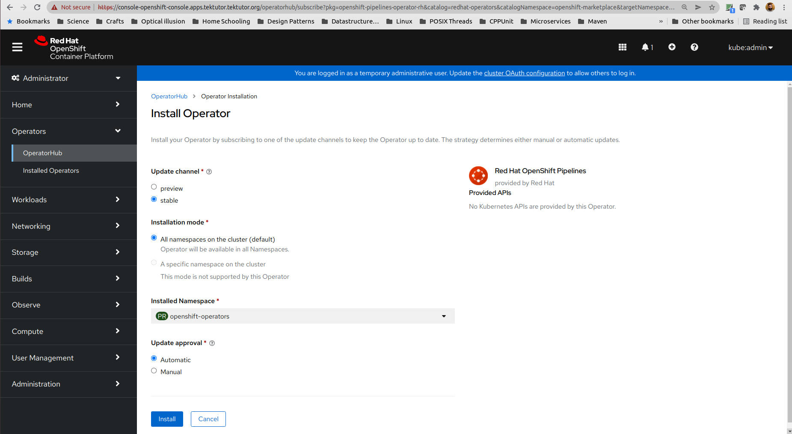
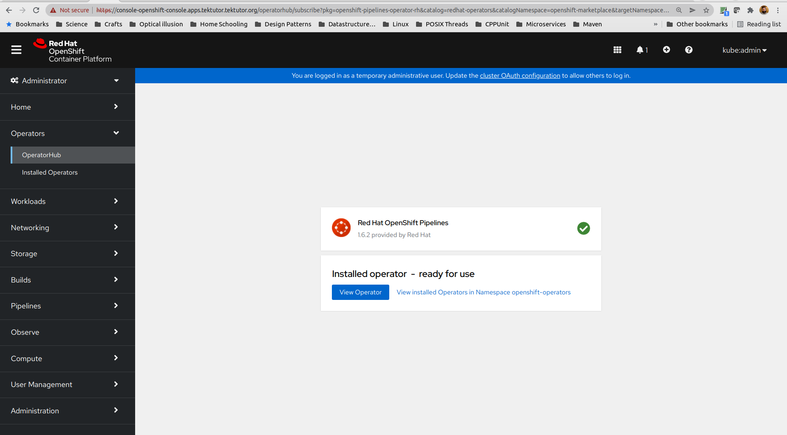

# Day 3 - Tekton

## Tekton CI/CD Pipeline
- Tekton is an opensource knative application that helps you create CI/CD 
  pipeline within Kubernetes/OpenShift cluster.
- Tekton supports both Kubernetes and OpenShift

## Installing Tekton within OpenShift Cluster

🔴 Only one person can perform this task in a Cluster as Tekton is installed cluster wide. 🔴

From the OpenShift web console, switch to Administrator view.  Navigate to Operators --> OperatorHub Menu on the Left side as shown in the screenshot below. In the search text box, you need to type "OpenShift Pipelines" to narrow down the search


Select "Red Hat OpenShift Pipelines" and Click on Install button.


You may now click on the Install button

Once you Click on the Install button, you will be taken to below screen


Once the Installation is complete, it will take you the below page


You may now click on the View Operator button which then takes you to the final page.


Congratulations! you have installed Tekton in your OpenShift Cluster.


## Installing Tekton CLI tool
```
cd ~/Downloads
wget https://github.com/tektoncd/cli/releases/download/v0.22.0/tkn_0.22.0_Linux_x86_64.tar.gz
tar xvf tkn_0.22.0_Linux_x86_64.tar.gz
mv tkn /usr/local/bin
```
Once tkn is installed, you may check the version of tkn cli tool by issuing the below command
```
tkn version
```

The expected output will be similar to shown below

<pre>
jegan@tektutor:~/tekton/tekton/lab1$ <b>tkn version</b>
Client version: 0.17.2
Pipeline version: v0.28.3
Triggers version: v0.16.1
</pre>

You may see a different version, may be much latest version than my environment.

## Tekton Jargons
Custom Resources added by Tekton project to your OpenShift Cluster

- Step
   - is a Custom Resource added by Tekton to your OpenShift cluster using CRD
   - Steps dictates the container that will run as part of the task
   - This is where the actual operations are performed
   - Steps can't be executed independently
   - Steps are always enclosed within a Task
   
- Task
   - is a Custom Resource added by Tekton to your OpenShift cluster using CRD
   - Task can be executed independently outside a Pipeline
   - each Task can have one or more Steps
   - Task can be scoped to a Project Scope or Cluster wide
   - Steps are the only required objects to create a Task
   - Tasks can be resused across Pipelines
   - Example:-
       - A Task can clone source code from a GitHub
       - A Task can build an container image, etc.,

- Pipeline
   - is a Custom Resource added by Tekton to your OpenShift cluster using CRD
   - collection of Tasks
   - results in an output based on your inputs given to CI/CD pipeline
   - Multiple Tasks in a Pipeline could be executed sequentially one after the other or in parallel
   - Example:-
      - a First Task could clone your source code from your GitHub Repo
      - a Second Task could compile your application after the First Task completes successfully
      - a Third Task could run Unit Tests on your compiled application if Second Task succeeds
      - a Fourth Task could package the binaries if Third Task succeeds
      - a Fifth Task could deploy the binaries to a JFrog Artifactory Server or Sonatype Nexus Server if Fourth Task succeeds
      - a Sixth Task could in parallel to Fifth Task can deploy the microservice to staging environment if Fourth Task succeeds

- TaskRun
   - is a Custom Resource added by Tekton to your OpenShift cluster using CRD
   - Task can be thought of like a Class, while TaskRun is a running instance of a Task
   - TaskRun helps you supply Task arguments that are required for a Task to run
     
- PipelineRun 
   - is a Custom Resource added by Tekton to your OpenShift cluster using CRD 
   - Pipeline can be thought of like a Class, while PipelineRun is a running instance of a Pipeline
   - PipelineRun invokes the Pipeline with custom parameter values that Pipeline expects
   - PipelineRun helps you supply Pipeline arguments that are required for a Pipeline while executing a CI/CD Pipeline

## What is a Tekton Trigger?
- Tekton Triggers is a Tekton component that allows you to detect and extract information from events from a variety of sources
- Tekton Triggers can invoke TaskRun and/or PipelineRun with the parameters retrieved from events
- Tekton Triggers is an extension to Tekton Pipelines
- For example:-
    - This helps in triggering a Tekton CI/CD pipeline based on code commit in GitHub repo or similar version control servers

## What is a Tekton Catalog?
 - Reusable Task and Pipeline Resources 

## What is Tekton Dashboard?
 - Web-based Dashboard for Tekton 
 - This needs to installed separately on-need basis
 - As OpenShift already comes with a GUI, this may not be necessary for us.

## Simple Hello World Task

A simple Hello World Task in Tekton looks as shown below

<pre>
apiVersion: tekton.dev/v1beta1
kind: Task
metadata:
  name: echo-hello-world
  namespace: jegan
spec:
  steps:
    - name: echo
      image: ubuntu
      command:
        - echo
      args:
        - "Hello World"
</pre>

In the above manifest file, you need to replace "jegan" with your project name.  You need to do this in all the following Lab exercises.

## ⛹️‍♂️ Lab - Creating your first Task using Tekton in OpenShift

Make sure "Red Hat OpenShift Pipelines" Operator is already installed in your Cluster and you have to personally install tkn cli tool on your Linux lab machine before proceeding below.

```
cd ~/openshift-tekton-feb-2022
git pull
cd Day3/tekton/hello
oc apply -f hello-world-task.yml
```

The expected output is
<pre>
jegan@tektutor:~/tekton/Day3/tekton/hello$ <b>oc apply -f hello-world-task.yml</b>
task.tekton.dev/echo-hello-world created
</pre>

You may now try to list the task using tkn cli utility

```
tkn task list
```

The expected output is
<pre>
jegan@tektutor:~/tekton/Day3/tekton/hello$ <b>tkn task list</b>
<b>NAME               DESCRIPTION   AGE</b>
echo-hello-world                 1 minute ago
</pre>

You may also try listing the task using oc cli tool
```
oc get task
```

The expected output is
<pre>
jegan@tektutor:~/tekton/Day3/tekton/hello$ <b>oc get task</b>
<b>NAME               AGE</b>
echo-hello-world   92s
</pre>

Executing your first hello-world task

```
tkn task start echo-hello-world
```

The expected output is
<pre>
jegan@tektutor:~/tekton/Day3/tekton/hello$ <b>tkn task start echo-hello-world</b>
TaskRun started: <b>echo-hello-world-run-9cwrx</b>

In order to track the TaskRun progress run:
<b>tkn taskrun logs echo-hello-world-run-9cwrx -f -n jegan</b>
</pre>

Let us now check the logs
```
tkn taskrun logs echo-hello-world-run-9cwrx -f -n jegan
```

The expected output is
<pre>
jegan@tektutor:~/tekton/Day3/tekton/hello$ <b>tkn taskrun logs echo-hello-world-run-9cwrx -f -n jegan</b>
[echo] <b>Hello World</b>
</pre>

## ⛹️‍♀️ Lab - Running the Task via TaskRun declaratively

TaskRun code looks as shown below,

<pre>
apiVersion: tekton.dev/v1beta1
kind: TaskRun
metadata:
  name: echo-hello-world-task-run
spec:
  taskRef:
    name: echo-hello-world
</pre>

Executing the above TaskRun
```
cd ~/openshift-tekton-feb-2022
git pull
cd Day3/tekton/

oc apply -f hello-taskrun.yml
```

The expected output is
<pre>
jegan@tektutor:~/tekton/Day3/tekton/hello-taskrun$ <b>oc apply -f hello-taskrun.yml</b>
taskrun.tekton.dev/echo-hello-world-task-run created
</pre>

Let's now check the status of the TaskRun as shown below
<pre>
jegan@tektutor:~/tekton/Day3/tekton/hello-taskrun$ <b>tkn taskrun list</b>
<b>NAME                        STARTED         DURATION   STATUS</b>
echo-hello-world-task-run   9 seconds ago   ---        Running(Pending)
</pre>

Let's now check detailed status of our TaskRun as shown below

<pre>
jegan@tektutor:~/tekton/Day3/tekton/hello-taskrun$ <b>tkn taskrun describe echo-hello-world-task-run</b>
Name:              echo-hello-world-task-run
Namespace:         jegan
Task Ref:          echo-hello-world
Service Account:   pipeline
Timeout:           1h0m0s
Labels:
 app.kubernetes.io/managed-by=tekton-pipelines
 tekton.dev/task=echo-hello-world

🌡️  Status

STARTED          DURATION     STATUS
59 seconds ago   37 seconds   Succeeded

📨 Input Resources

 No input resources

📡 Output Resources

 No output resources

⚓ Params

 No params

📝 Results

 No results

📂 Workspaces

 No workspaces

🦶 Steps

 NAME     STATUS
 ∙ echo   Completed

🚗 Sidecars

No sidecars
</pre>
