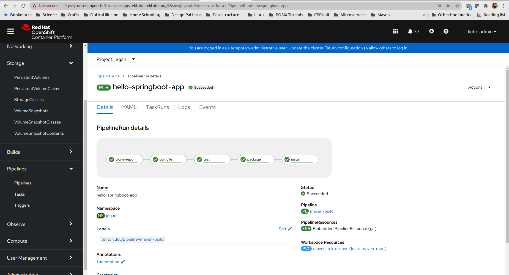

## ⛹️‍♀️ Lab - Installing NFS Server in CentOS 7.x/8.x
```
sudo yum install -y nfs-utils
```

Enable nfs service and start it
```
sudo systemctl enable nfs-server rpcbind
sudo systemctl start nfs-server rpcbind
```

Let's create a directory that can be used by our OpenShift Cluster as a PersistentVolume.
```
sudo mkdir -p /nfsshare
```

Let's make sure everyone can access the folder
```
sudo chmod 777 /nfsshare/
```

Now we need to add the above folder to the /etc/exports file to actually expose the folders to the outside world
```
sudo vim /etc/exports
```
Add the below line to the file
<pre>
/nfsshare  192.168.122.0/24(rw,sync,no_root_squash)
</pre>
The above 192.168.122.0/24 is the the subnet of the OpenShift node IPs.  In case this is different, we need to modify accordingly.

Let's make sure the NFS servers exported the folders
```
exportfs -r
```

Let's open up the firewall ports to it will let in the NFS connection requests
```
sudo firewall-cmd --permanent --add-service mountd
sudo firewall-cmd --permanent --add-service rpc-bind
sudo firewall-cmd --permanent --add-service nfs
firewall-cmd --reload
```

## ⛹️‍♂️ Lab - Executing the pipeline which shares files via PersistentVolume
Delete your project in case it is already there to free up memory, disk and computing resources.
```
oc delete project jegan
```

Create a new Project
```
oc new-project jegan
```

As the pipeline uses git-clone and maven tasks from Tekton Catalog, you need to install them first in your project scope.
```
tkn hub install task git-clone
tkn hub install task maven
```

<pre>
If your userid is between user31 to user40 you are using Cluster1. Hence you should use 192.168.1.105 NFS Server.
If your userid is between user41 to user50 you are using Cluster2. Hence you should use 192.168.1.118 NFS Server.
</pre>
First let us create the Persistent Volume 

In the below file i.e "maven-tekton-pv.yml", you need to update the IP Address of the NFS Server either to 192.168.1.105 or to 192.168.1.118 depending on the Cluster you are connected to.

You also need to change the Path to /nfsshare/user<x> in case you are connected to 192.168.1.105. The x can be 1 to 10, dependending on which user you are using to login to the lab machine.
  
You also need to change the Path to /nfsshare/user<x>. The value of x is 1 to 10, you need to change that as per the user alloted to you on the first day.

```
cd ~/openshif-tekton-feb-2022
git pull
cd Day3/tekton/build-maven-project
oc apply -f maven-tekton-pv.yml
```

You may list and see the Persistent Volume
```
oc get pv
```
The above Persistent volume is created on the NFS Server we connected in the PersistentVolume Manifest file.


Then you can create the Persistent Volume Claim
```
cd ~/openshif-tekton-feb-2022
git pull
cd Day3/tekton/build-maven-project
oc apply -f maven-tekton-pvc.yml
```

You may list and see the Persistent Volume and Persistent Volume Claim here
```
oc get pv, pvc
```

If the PersistentVolumeClaim is found to Bound with the PersistentVolume created above, then you are good to proceed
```
cd ~/openshif-tekton-feb-2022
git pull
cd Day3/tekton/build-maven-project
oc apply -f maven-tekton-pipeline.yml
```

You may list the pipeline as shown below
```
tkn pipeline list
```

At this point, it is a good idea to move to the OpenShift Webconsole. Make sure you select your project.

## Tekton variables
- Tekton variables can be either string or array
- if no type is specified, Tekton assumes it is a string
- the description and default fiels of a parameter are optional

## Installing Tekton Triggers
```
kubectl apply --filename https://storage.googleapis.com/tekton-releases/triggers/latest/release.yaml
kubectl apply --filename https://storage.googleapis.com/tekton-releases/triggers/latest/interceptors.yaml
```
The expected output is
<pre>
jegan@tektutor:~/tekton/Day4$ kubectl apply --filename https://storage.googleapis.com/tekton-releases/triggers/latest/release.yaml
Warning: policy/v1beta1 PodSecurityPolicy is deprecated in v1.21+, unavailable in v1.25+
podsecuritypolicy.policy/tekton-triggers created
clusterrole.rbac.authorization.k8s.io/tekton-triggers-admin created
clusterrole.rbac.authorization.k8s.io/tekton-triggers-core-interceptors created
clusterrole.rbac.authorization.k8s.io/tekton-triggers-eventlistener-roles created
clusterrole.rbac.authorization.k8s.io/tekton-triggers-eventlistener-clusterroles created
role.rbac.authorization.k8s.io/tekton-triggers-admin created
role.rbac.authorization.k8s.io/tekton-triggers-admin-webhook created
role.rbac.authorization.k8s.io/tekton-triggers-core-interceptors created
role.rbac.authorization.k8s.io/tekton-triggers-info created
serviceaccount/tekton-triggers-controller created
serviceaccount/tekton-triggers-webhook created
serviceaccount/tekton-triggers-core-interceptors created
clusterrolebinding.rbac.authorization.k8s.io/tekton-triggers-controller-admin created
clusterrolebinding.rbac.authorization.k8s.io/tekton-triggers-webhook-admin created
clusterrolebinding.rbac.authorization.k8s.io/tekton-triggers-core-interceptors created
rolebinding.rbac.authorization.k8s.io/tekton-triggers-controller-admin created
rolebinding.rbac.authorization.k8s.io/tekton-triggers-webhook-admin created
rolebinding.rbac.authorization.k8s.io/tekton-triggers-core-interceptors created
rolebinding.rbac.authorization.k8s.io/tekton-triggers-info created
customresourcedefinition.apiextensions.k8s.io/clusterinterceptors.triggers.tekton.dev created
customresourcedefinition.apiextensions.k8s.io/clustertriggerbindings.triggers.tekton.dev created
customresourcedefinition.apiextensions.k8s.io/eventlisteners.triggers.tekton.dev created
customresourcedefinition.apiextensions.k8s.io/triggers.triggers.tekton.dev created
customresourcedefinition.apiextensions.k8s.io/triggerbindings.triggers.tekton.dev created
customresourcedefinition.apiextensions.k8s.io/triggertemplates.triggers.tekton.dev created
secret/triggers-webhook-certs created
validatingwebhookconfiguration.admissionregistration.k8s.io/validation.webhook.triggers.tekton.dev created
mutatingwebhookconfiguration.admissionregistration.k8s.io/webhook.triggers.tekton.dev created
validatingwebhookconfiguration.admissionregistration.k8s.io/config.webhook.triggers.tekton.dev created
clusterrole.rbac.authorization.k8s.io/tekton-triggers-aggregate-edit created
clusterrole.rbac.authorization.k8s.io/tekton-triggers-aggregate-view created
configmap/config-defaults-triggers created
configmap/feature-flags-triggers created
configmap/triggers-info created
configmap/config-logging-triggers created
configmap/config-observability-triggers created
service/tekton-triggers-controller created
deployment.apps/tekton-triggers-controller created
service/tekton-triggers-webhook created
deployment.apps/tekton-triggers-webhook created
jegan@tektutor:~/tekton/Day4$ kubectl apply --filename https://storage.googleapis.com/tekton-releases/triggers/latest/interceptors.yaml
deployment.apps/tekton-triggers-core-interceptors created
service/tekton-triggers-core-interceptors created
clusterinterceptor.triggers.tekton.dev/cel created
clusterinterceptor.triggers.tekton.dev/bitbucket created
clusterinterceptor.triggers.tekton.dev/github created
clusterinterceptor.triggers.tekton.dev/gitlab created
</pre>  

Let's give permission for the interceptor
```
kubectl apply -f https://raw.githubusercontent.com/arthurk/tekton-triggers-example/master/01-rbac.yaml
```

You may monitor the installation status
```
kubectl get pods --namespace tekton-pipelines --watch
```

## ⛹️‍♀️ Lab - Caching Maven Local Repo to speed up build as part of a pipeline
This pipeline will create a PersistentVolume in your NFS Server. Then creates a PersistenVolumeClaim that is
used by all the tasks used in the pipeline.
  
In the persistent volume both source code and local repository will be cached, but the local repository will be retained.
```
cd ~
cd openshift-tekton-feb-2022
git pull
cd Day4/CachingMavenLocalRepo
  
oc apply -f pipeline.yml
```

The expected output is
<pre>
jegan@tektutor:~/tekton/Day4/CachingMavenLocalRepo$ <b>oc apply -f pipeline.yml</b>
persistentvolume/maven-tekton-pv created
persistentvolumeclaim/maven-tekton-pvc created
task.tekton.dev/mvn created
pipeline.tekton.dev/maven-build created
pipelinerun.tekton.dev/hello-springboot-app created
</pre>

You may now check the webconsole for the pipeline ru name maven-build.

